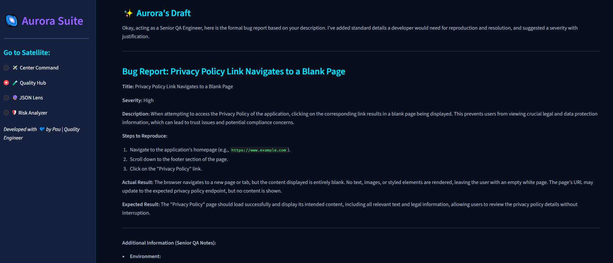
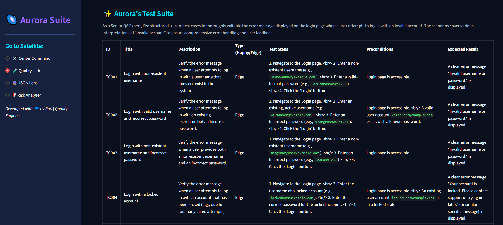
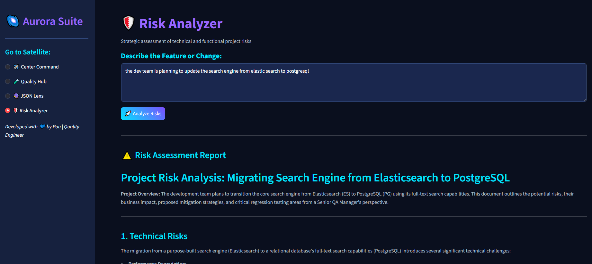
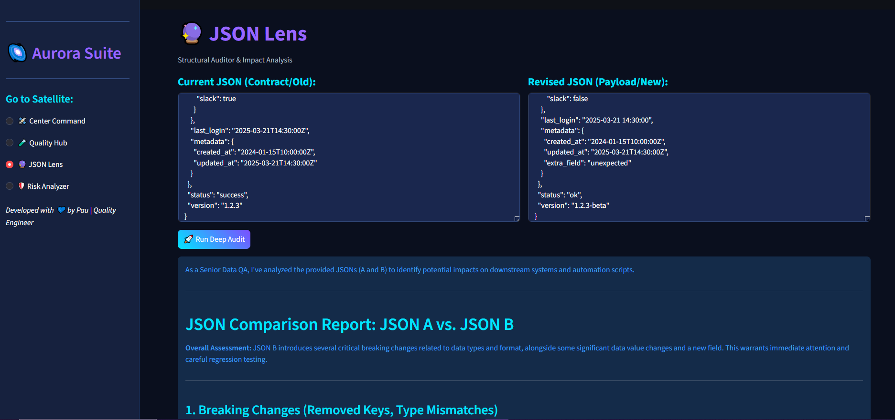

# 🌌 Aurora Engineering Suite
**AI-Powered Strategic Testing Assistant**

Aurora is a professional-grade tool designed for Quality Engineers to streamline documentation, test design, API validation and risk assessment using Google's Gemini 2.5 Flash

## ✨ Key Features
- **📝 Report Assistant:** Transforms informal notes into professional Markdown bug reports
- **💻 Test Case Generator:** Creates structured test suites (Happy Path & Edge Cases)
- **🛡️ Risk Analysis:** Evaluates project context to identify technical and functional risks
- **🔮 JSON Lens:** A structural data auditor leveraging GenAI to detect breaking changes and integration risks in complex JSON payloads

## 🛠️ Tech Stack
- **Language:** Python 3.10+
- **Frontend:** Streamlit
- **AI Engine:** Google GenAI SDK (Gemini 2.5/3.0)
- **Styling:** Custom CSS "Deep Space" Theme

## 🚀 Quick Start
1. Clone the repo: `git clone`
2. Install dependencies: `pip install -r requirements.txt`
3. Create a `.env` file with your `GOOGLE_API_KEY`.
4. Launch Aurora: `streamlit run app.py`

## 📸 Visual Showcase

<b>Click to see Aurora in Action! 🚀</b>

### 📝 Report Assistant
*Transforming messy notes into professional bugs*

### 💻 Test Case Generator
*Clean tables and structured scenarios*

### 🛡️ Risk Analyzer
*Strategic evaluation of technical and functional impacts*

### 🔮 JSON Lens
*Deep structural analysis of complex JSON payloads*

---
*Developed with 💙 by Pau | Quality Engineer*
